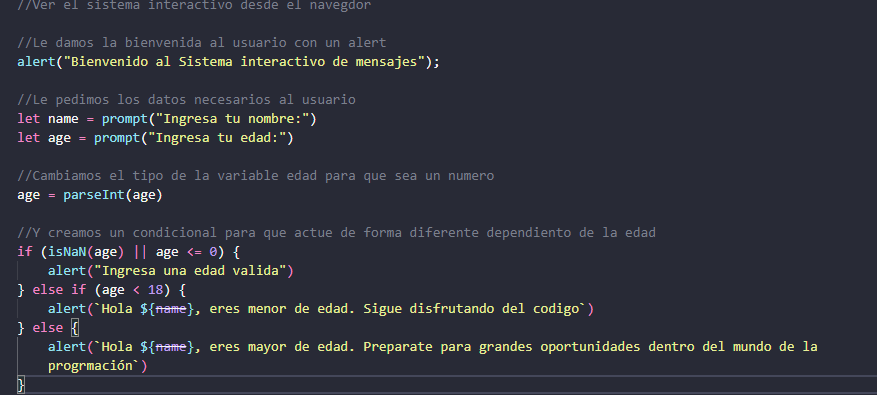
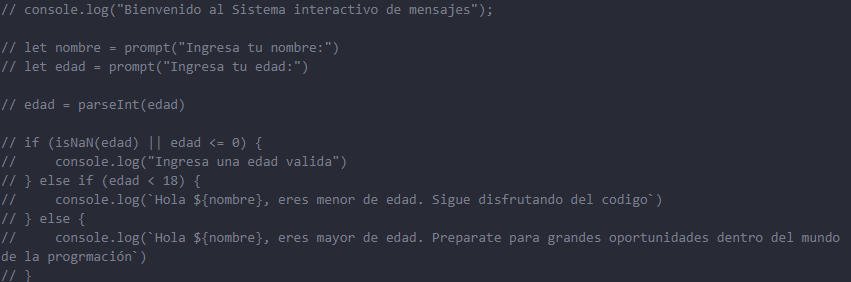

# Entrenamiento Modulo 3 - Semana 1
Hice algunos "cambios" y vincule el archivo .js a un documento de html, por lo que no es necesario utilizar la consola.

En caso de querer ver el sistema interactivo desde la consola, en el archivo sistema_interactivo.js
comentar lo que se muestra en la imagen:

Y descomentar lo que se muestra en la siguiente imagen:

Ademas de esto en la condicion verifique de que el usuario ingrese una edad mayor a 0 para que el sistema tenga coherencia.